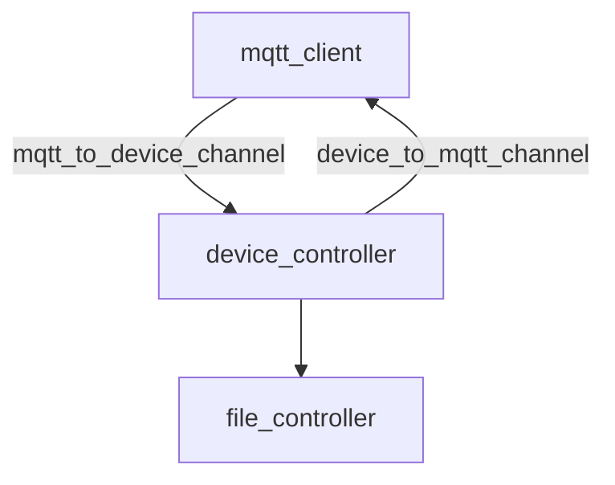

# 🦀 Rust！安全高性能的 MQTT 智能家居控制器中间件

✅️ 智能家居：MQTT 协议转换到 dmx，串口，modbus，声卡，串口设备。

✅️ 可部署到 linux（实测 debian）

✅️ 全 Rust 编写，无 unsafe 代码，安全高性能。

主要功能：
- 设备配置：支持单个 dmx，modbus 接口接入多个子设备，每个子设备可用配置文件定义
- 设备控制：在设备配置文件中的设备可被 mqtt 协议独立控制
- 状态管理：侦听、管理设备状态，并定时通过 mqtt 协议上报给上位机
- 文件管理：可从上位机同步音视频文件到本地
- 支持设备
  - USB 声卡（使用 ALSA 输出）
  - dmx 协议（使用 usb-dmx 输出）
  - modbus 协议（使用 485 输出）
  - 通用串口协议（使用 485 输出）

应用场景：智能家居、展厅、博物馆会展等

👉 该服务当前要配合上位机使用，如需帮助请联系文档末尾邮箱。

## 1 安装和运行

Debian：

```bash
# 库依赖
sudo apt install libasound2-dev build-essential libssl-dev cmake libsqlite3-dev

# rust 语言
sudo apt install rustc
```

运行：
```bash
cargo build
```

## 2 系统结构简介



### 2.1 三大模块
- mqtt_client：mqtt 客户端，用于发送和接收来自上游 flow 服务器的请求
  - 单线程模式：运行后创建独立线程管理 mqtt 请求
- device_controller：设备控制器，由 mqtt_client 控制
  - 三线程模式
    - 设备管理线程：创建并维护设备实例，控制下发的设备请求
    - 心跳线程：计时并定时向 mqtt_client 发送心跳
    - 状态侦听线程：侦听设备的状态改变，并及时上报到 mqtt_client
  - 设备通信信道
    - 设备信息上报通道：tx 交给设备管理线程，rx 交给状态侦听线程
  - 设备信息表 DeviceInfoDtoHashMap
    - 存储设备状态 state 和配置 config，是一个独立的数据结构，心跳线程将直接使用该表中的数据发送心跳。
    - 状态侦听线程在设备状态改变时会更新该信息表
- file_controller：文件管理器
  - 设备信息 HashMap 是一个线程安全结构，支持热更新

### 2.2 通信信道
- mqtt_to_device_channel：设备指令信道
- device_status_channel：设备状态改变信道

### 2.3 设备管理

设备管理分 4 个部分
- 设备驱动对象：主要为设备逻辑的部分
- 设备工厂：管理设备的创建参数，创建设备驱动对象
- 设备类型枚举：使用静态枚举方式将所有的设备放在同一个结构体中
- 设备管理器（device_controller）：读取设备配置文件，根据配置文件的类型，调用工厂方法组装驱动对象。然后记录在设备管理器自有的数据结构中

## 3 其他资料

见 docs 文件夹

## 联系我

hansenzh11@hotmail.com
